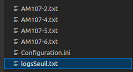
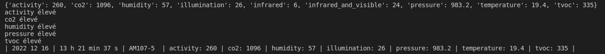
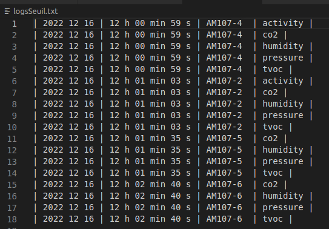
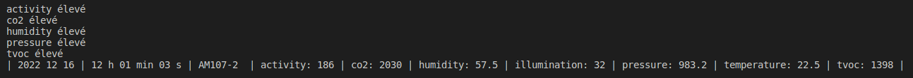
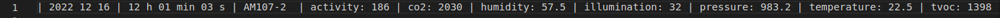
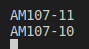
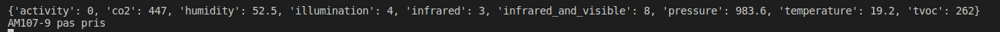

= Documentation des Tests Python G1A-3

====
* L'arborescence de l'application lors l'exécution :

====

====
* Affichage sur le terminal lorsque certains valeurs d'un capteur dépassent les seuils maximaux

* Affichage des logs des capteurs dépassant les seuils maximaux (triés par capteurs - par date de réception des données):

====

====
* Récupération des données du capteur AM107-2 et affichage à l'écran :

* Le fichier du capteur AM107-2 après écriture des données :

====

====
* Affichage à l'écran des capteurs qui ne sont pas utilisés :

* Il est toujours possible de récupérer les valeurs des capteurs n'étant pas souhaités par l'utilisateur :

====

Conclusion :

------ Le programme passent tous les tests inspirés des critères d'évaluation du programme ! ------