= Documentation Utilisateur G1A-3

=================

Si ce n'est déjà fait, vous pouvez lire la documentation d'installation ici : 

link:https://github.com/IUT-Blagnac/sae3-01-devapp-g1a-3/blob/master/Documentation/Documentations%20Python/Documentation%20Installation%20Python%20G1A-3.adoc[Documentation d'installation]

Ce document présente la documentation utilisateur du programme python et du fichier de configuration .ini afin de comprendre leur fonctionnement.

* Les paramètres :

====

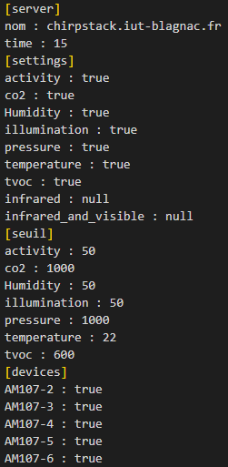

* Le champ *Server* :

** Le nom du serveur comportant les différents capteurs AM107.
** L'intervalle de temps _time_ entre chaque écriture dans les fichiers de chaque capteur des données récupérées dans cet intervalle de temps.

* Le champ *Settings* :

** Il contient pour chaque type de mesure des capteurs une valeur true/false/null qui décidera si les données du type seront relevées.

* Le champ *Seuil* :

** Il contient toutes les données mesurées possibles et le niveau limite qui leur est associé.

* Le champ *devices* :

** Il contient tous les capteurs où les données peuvent être lues (true/false).
   
====

* Les Imports :

====

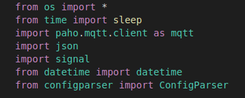

    - Liste des imports nécéssaires pour l'utilisation du programme 

    * Le module os permet d'utiliser les fonctions bas niveau tel que open (ouverture d'un fichier), close (fermeture d'un fichier) et write (écriture dans un fichier).
    * Le module time permet d'importer la fonction sleep().
    * Le module paho.mqtt.client permet de créer une liaison avec les capteurs mqtt et de recevoir et lire les données de ceux-ci.
    * Le module json nous permet de charger et récupérer les fichiers JSON contenant les informations des capteurs.
    * Le module datetime nous permet de connaitre et stocker l'heure et la date exacte de chaque message d'un bus de données provenant d'un capteur.
    * Le module configparser permet de lire le fichier de configuration en .ini qui contient les différents paramètres du projet.

====

* Définition des variables :

====

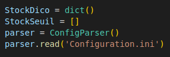

StockDico est un dictionnaire contenant les clés (noms des différents capteurs), les valeurs par défaut (chaine avec la date, l'heure et l'appareil) ainsi que les valeurs des capteurs demandées par l'utilisateur toutes séparées par des barres horizontales.

StockSeuil est une liste avec la date, l'heure, l'appareil ainsi que le type de valeur de l'appareil ayant une valeur étant supérieure au seuil maximal paramétrée dans le fichier de configuration.

La variable _parser_ va permettre de lire le fichier _configuration.ini_ car celle-ci est de type ConfigParser()
    

====

* La fonction envoie() :

====

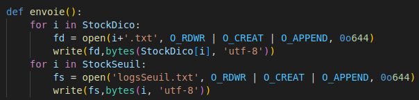

* La fonction envoie() parcours le dictionnaire _StockDico_ et défini un descripteur de fichier pour ouvrir ou créer un fichier _.txt_ puis écris les valeurs de ce capteur dans le fichier. Chaque capteur possède son fichier avec les valeurs correspondantes.
* La deuxième boucle parcours la liste _StockSeuil_ et défini un descripteur de fichier pour ouvrir ou créer un fichier _logsSeuil.txt_ afin d'y écrire tous les dépassements de seuil relevés lors du fonctionnement de l'application.

====

* Méthode get_data() :

====

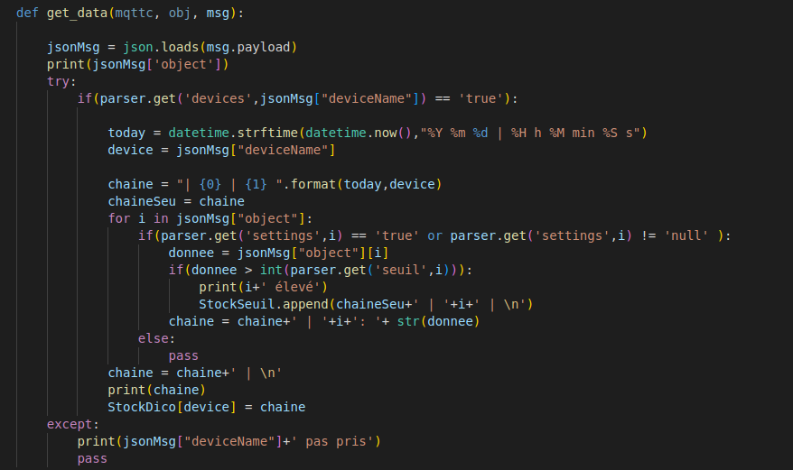

* Image générale de la méthode get_data(). Nous allons la parcourir partie par partie :

=====
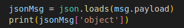

* Cette partie permet de récupérer le message JSON obtenu par les capteurs et de l'affecter à la variable _jsonMsg_ et d'afficher les _objects_ de ce messsage pour les tests.

=====  
=====
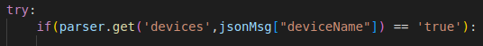

* Cette partie permet de récupérer toutes les erreurs provoquées lors de l'exécution du programme.
* Le _if_ permet de filtrer les appareils a conserver lors de la lecture des bus de données pour l'écriture dans les fichiers capteurs. Pour cela, on regarde si le nom de l'appareil est dans la partie _device_ du fichier de configuration.

=====
=====
image::./images/debutchaine.png[]

* On stocke l'heure et la date dans une variable _today_ et on assure la lisibilité de la chaine grâce au formattage de celle-ci.
* On récupère et on stocke le nom de l'appareil ayant envoyé le message.
* On commence a mettre en forme le début de la chaine grâce à la variable _chaine_.
* On recopie la chaine dans _chaineSeu_ qui nous permet d'avoir la chaine initiale afin de gérer l'ajout dans les logs des Seuils.

=====
=====
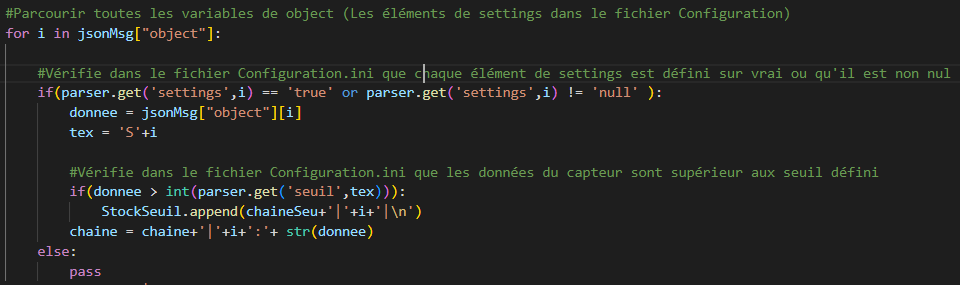

* Cette partie permet de mettre en forme la chaine avec les valeurs _true_ du fichier de configuration.

** On va parcourir tous les clés des valeurs du message json
** On teste si la valeur de la clé (ici le nom de la variable dans le fichier json) est égale à _true_ (si c'est le cas, cela signifie que l'on doit garder la donnée sinon on l'oublie) ou si la valeur n'est pas égale a null.(si c'est le cas, cela signifie que la variable n'est pas intéressante.).
** Puis on récupère la valeur associée à la variable du fichier json.
** On teste ensuite si la valeur récupérée est supérieure au seuil maximal du fichier de config pour le type obtenu. Si c'est le cas, on affiche dans le terminal que la valeur est élevée puis on l'ajoute a la liste _StockSeuil_ avec le bon formattage.
** Enfin, on concatène les chaines avec les valeurs récupérés dans le JSON.

=====
=====
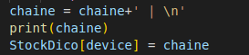
* Cette partie de code permet de sauter une ligne entre les différentes valeurs récupérées pour chaque capteur, afficher la chaine obtenue pour s'assurer du bon fonctionnement du programme et ajouter la chaine finale dans le dictionnaire comme valeur de la clé (le nom de l'appareil).

=====
=====
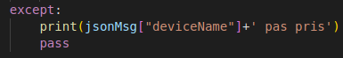

* Cette partie du programme fait suit au _try_ de début de programme. Si le programme exécute cette partie de code, cela signifie que le nom de l'appareil reçu n'est pas demandé dans le fichier de configuration. On affiche le nom de cette appareil pour les tests et on continue le programme avec _pass_.

=====
====

* Programme principal :

====

=====

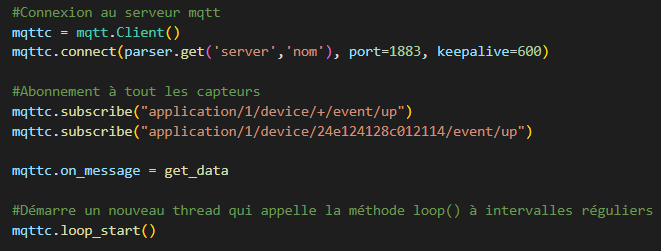

* Cette partie du programme permet d'effectuer la gestion des bus _mqtt_ : 
** On commence par créer la connexion aux serveur _mqtt_ avec le nom du serveur en paramètre.
** On s'abonne ensuite à tous les appareils qui émettent des données.
** On paramètre la fonction _get_data()_ à effectuer lors de la reception d'un message. 
** Enfin, on boucle à l'infini pour écouter les messages émis par les capteurs.

=====
=====
image::./images/Capture d’écran du 2022-12-16 15-01-29.png[]

* Le programme boucle à l'infini afin d'assurer la gestion de la fréquence d'écriture dans les fichiers capteurs. Pour ce faire, le programme utilise la fonction sleep() pour dormir _x_ minutes selon la fréquence d'écriture paramétrée dans le fichier de configuration.
* Après que l'intervalle de temps soit passé, on remet a zéro le dictionnaire _StockDico_ et la liste _StockSeuil_ afin que chaque valeur écrite dans les fichiers capteurs soit unique.
=====
====
=================
