= Documentation des Tests Web G1A-3

-------
Tous les tests présents dans ce documents présentent des fonctionnalités finalisés !
-------

====
Cette documentation montre le fonctionnement de la page de connexion / création de compte du site "La Parure Française" à travers différents tests : 
=====
* Le design de la page de Connexion / Création de compte :

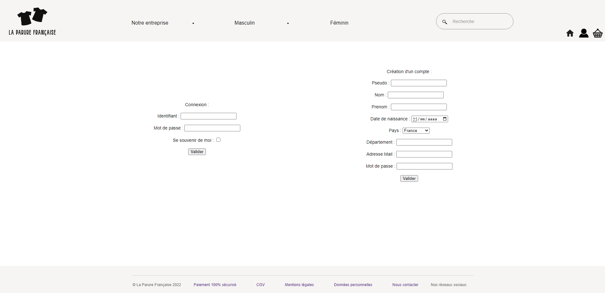
=====

=====
Commençons par la tentative de connexion à un compte :

* Si on tente de cliquer immédiatement sur le bouton _Valider_ : 

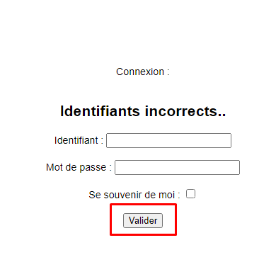

* Si on entre des identifiants erronés : 

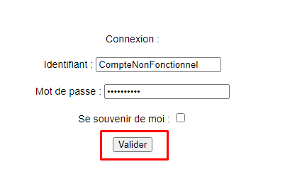
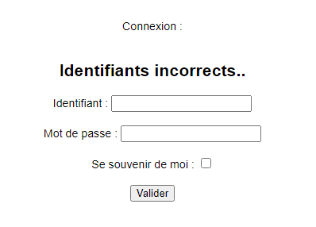

* Si on entre des identifiants valides et que l'on sauvegarde l'identifiant de l'utilisateur : 

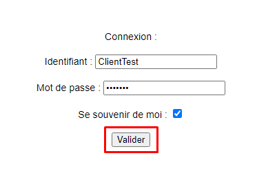

* Un message s'affiche comme quoi la connexion a bien effectuée : 

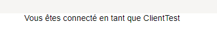

* L'utilisateur est renvoyé vers la page d'index :

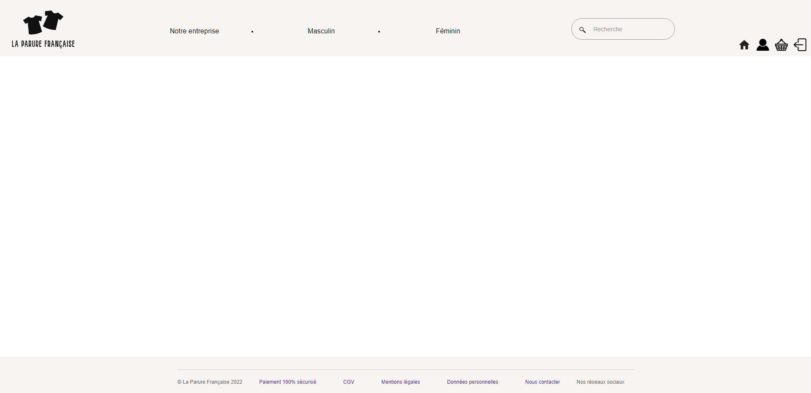
=====

=====
* Une fois que l'utilisateur est connecté, l'utilisateur a deux possibilités à la déconnexion :
======
* Il peut se déconnecter sans enlever les cookies : 

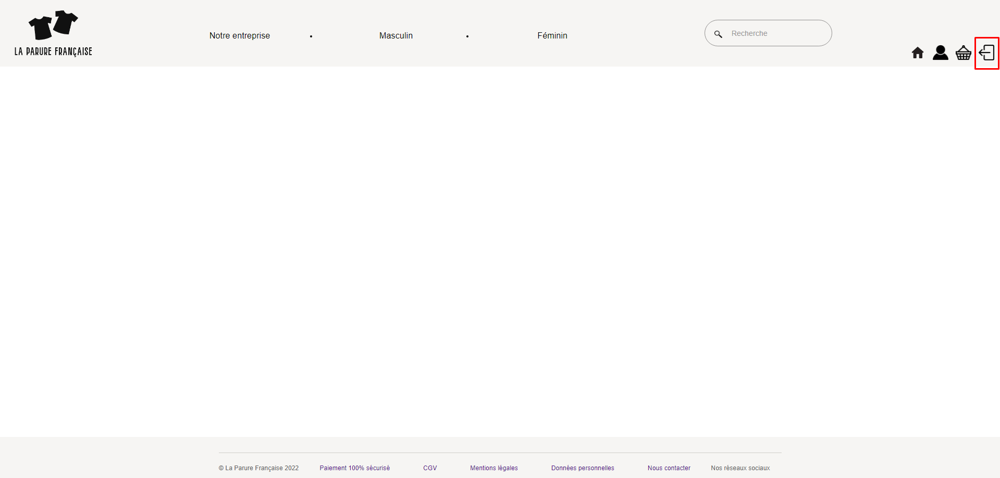

* L'identifiant est donc sauvegardé pour la prochaine connexion de l'utilisateur : 

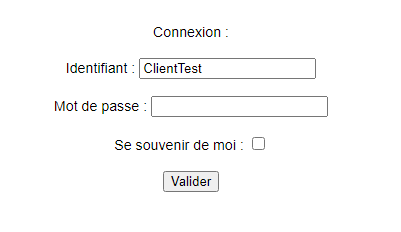

* L'option de suppresion des cookies est donc toujours disponible dans le footer :

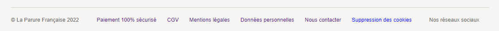

======

======
* Sinon, l'utilisateur peut supprimer les cookies avant sa déconnexion :

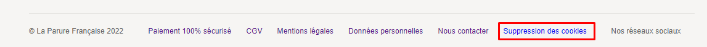

* Le menu de suppression disparait du footer :

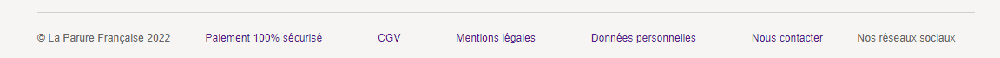

* Après la déconnexion de l'utilisateur, l'identifiant utilisateur aura disparu du formulaire de connexion :

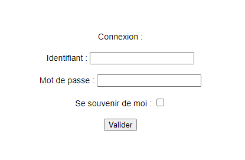

======

=====

=====

On peut également créer un compte :

* Si on tente de cliquer immédiatement sur le bouton _Valider_ : 

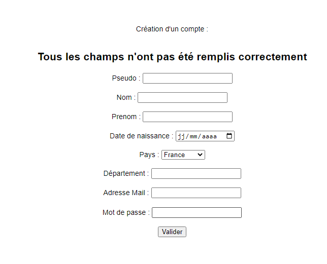

* Si l'utilisateur remplis tous les champs nécessaires pour la création du compte : 

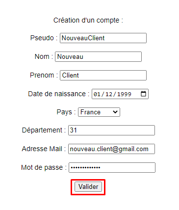

* L'utilisateur est redirigé vers l'index :

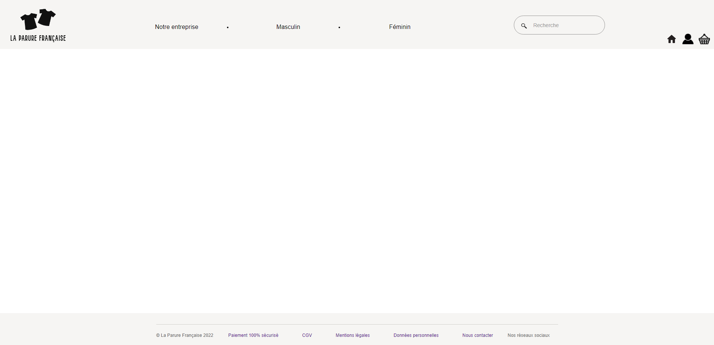

* On peut aller vérifier que le client a bien été créé dans la base de données et que le mot de passe entré par l'utilisateur a bien été hashé :

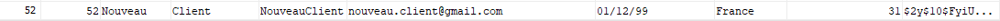

* Après la création du compte, on peut tenter de se connecter à celui-ci avec les identifiants que l'utilisateur vient de créer :

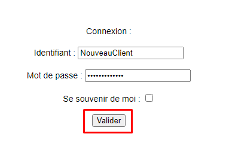

Même si le mot de passe est stockée en HASH, on utilise une fonction PHP permettant de s'assurer que celui entrée par l'utilisateur dans le formulaire correspond à celui dans la base de données.

* La connexion fonctionne et l'utilisateur voit un message de connexion s'afficher :

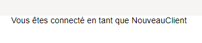

-------
La documentation des tests du site web sera mise à jour lors du sprint 7 avec l'ensemble des fonctionnalités ajoutées
-------

=====

====
