= Documentation Utilisateur site web G1A-3
:toc:
:toc-title: Table des matières
:sectnums:
:sectnumlevels: 4
:hide-uri-scheme:

Equipe : G1A-3
```
    - Mabille Matthis
    - Massip Romain
    - Babel Teddy
    - Benachir Alexandre
    - Druelle Julien
```
Date de la dernière modification : 27/01/2023

Version finale du site : V6

Site web e-commerce de *_La Parure Française_*

== Présentation générale du Projet
=== Contextualisation

*_La Parure Française_* est une entreprise artisanale Française ayant besoin d'effectuer la refonte de son site d’E-commerce pour gagner des parts de marchés et de gagner en visibilité, bénéfices et notoriété. De plus, la vente de vêtements est un milieu très concurrentiel et cette refonte permettrait de posséder un avantage concurrentiel national et d'étendre l'image de la qualité Française.

=== Accès au site web

==== Avec le réseau de l'IUT (en réseau filaire)
Afin d'accéder au site web, ouvrez votre navigateur web favori et saisissez l'adresse suivante : http://192.168.224.139/~SAESYS03/Site

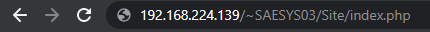

==== Avec votre propre réseau

Afin d'accéder au site web, ouvrez votre navigateur web favori et saisissez l'adresse suivante : http://193.54.227.164/~SAESYS03/Site

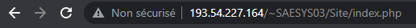

=== Utilisateurs concernés

Différents types d'utilisateurs peuvent utiliser le site : 

- Tout *utilisateur lambda* qui ne possède pas de compte
- Les *utilisateurs connectés*, clients de La Parure Française
- Les *administrateurs connectés* de la Parure Française

Les fonctionnalités possibles diffèrent selon les rôles des utilisateurs : 

- N'importe quel utilisateur peut accéder à des fonctionnalités qui ont pour utilité de "vitrine" uniquement.
- Les clients du site peuvent effectuer toutes les actions d'un utilisateur lambda et peuvent effectuer diverses actions liés aux commandes, au panier, aux produits et à la gestion de leur compte client.
- Les administrateurs du site ont accès à toutes les fonctionnalités disponibles et peuvent gérer le stock des produits, gérer les comptes utilisateurs, consulter les messages des formulaires clients et créer des comptes administrateurs.

== Fonctionnalités visiteurs / clients

=== Page d'accueil du site

Lorsque vous êtes redirigé vers notre site, vous arrivez sur la page d'accueil. 
Vous pouvez y accéder à tout moment en cliquant sur le logo "Home" en haut à droite de la page.

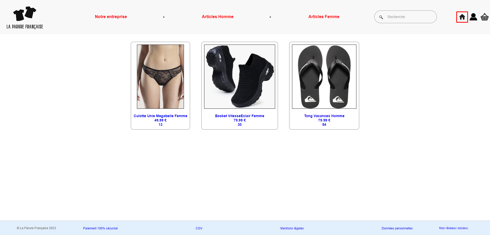

==== Entête du site 

===== Les menus déroulants

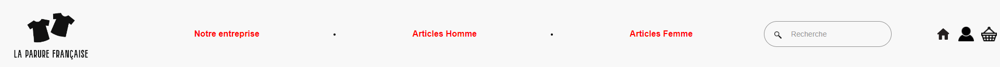

L'entête du site possède plusieurs menus et plusieurs fonctionnalités que nous allons explorer au fur et à mesure.

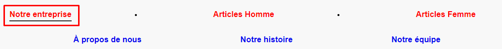

Pour commencer, nous pouvons passer la souris sur le menu "*Notre entreprise*" et un menu déroulant s'affiche avec différents sous-menus.

Chaque sous-menu est associé à un titre de la page de présentation de l'entreprise et positionne la page à la position du titre sélectionné.

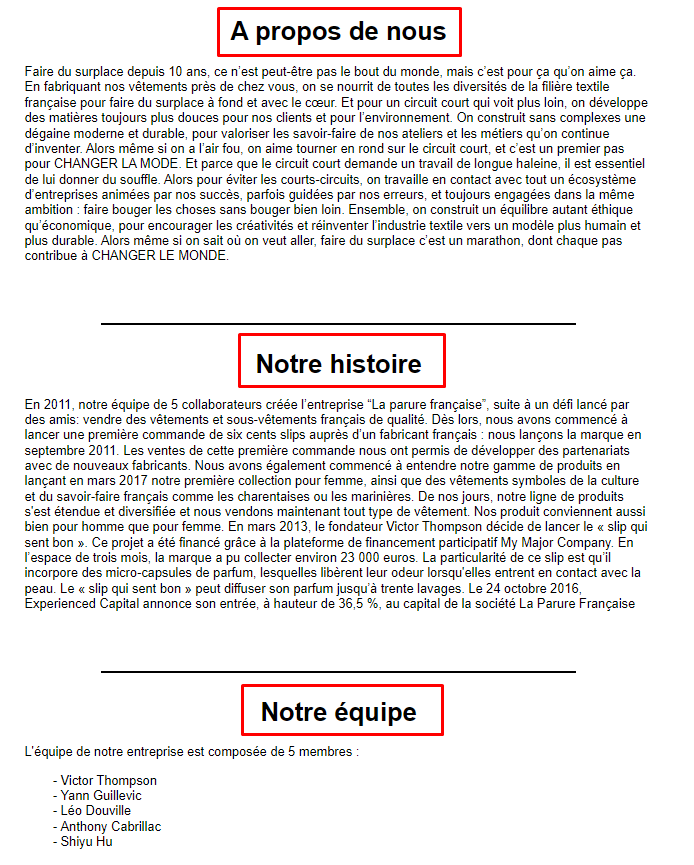

On peut également consulter le menu déroulant "Articles Homme" qui comporte trois parties. Le nom de la "super-catégorie" (_Articles Homme_), le nom de la catégorie des produits (exemple : _Sous-vêtements_), et le nom de la sous-catégorie (exemple : _Boxers_)

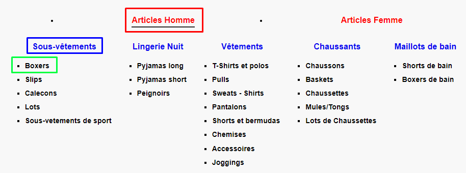

Lors d'un clic sur "Articles Homme", vous arrivez sur la page suivante : 

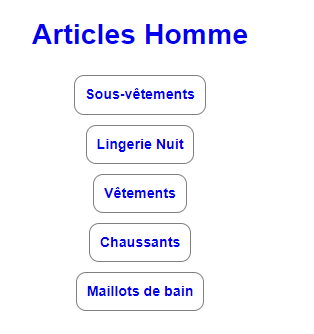

Cette page nous offre la possibilité d'accéder aux sous-catégories depuis ce menu. Cette page permet aux utilisateurs sur des appareils mobiles / tablettes d'accéder à un menu similaire au menu déroulant (auxquels ces utilisateurs n'ont pas accès).

Si on clique maintenant sur "Sous-vêtements" depuis la page obtenue ou depuis le menu déroulant de haut de page, nous sommes redirigé vers la page suivante :

image::images/ss-vêtements.png[entreprise]

Le même principe que la page précédente est appliquée pour toutes les sous-catégories pour les mêmes raisons que précedemment. On peut maintenant cliquer sur "Boxers" dans le menu déroulant et sur la page pour aller consulter la liste des Boxers.

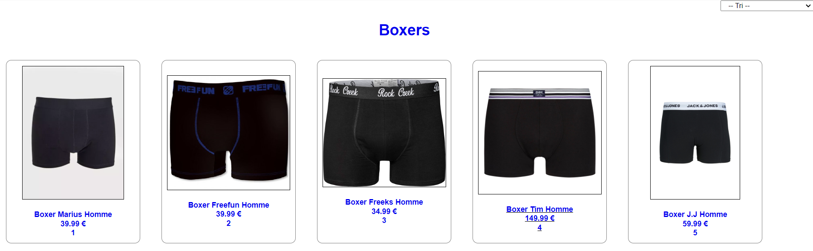

On obtient donc une page avec l'entièreté des produits de la catégorie / sous-catégorie demandée. Nous pourrons cliquer sur ces produits (ou leurs images) afin de consulter les détails de ceux-ci. Nous pourrons également trier les produits de différentes façons.

_A noter : Ces deux fonctionnalités seront expliqués dans la section *Produit* et *Détails Produits* de la documentation_

===== La barre de recherche

Vous pouvez également rechercher des produits à travers la barre de recherche.
Plusieurs cas de recherche sont possibles :

- On peut recherche par nom de produits / catégories (_la casse des mots n'importe pas_)

Que ce soit :

- Avec une Majuscule :

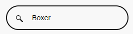
- Seulement en minuscules

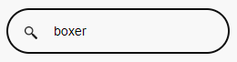
- Tout en MAJUSCULES

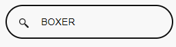
- Majuscules et minuscules alternées :

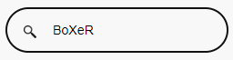
- Seulement avec le début du mot

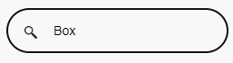

Les produits obtenus dans le résultat seront identiques dans toutes les recherches (_et potentiellement d'autres produits seront ajoutés selon la taille du mot entré_) seront toujours les mêmes !

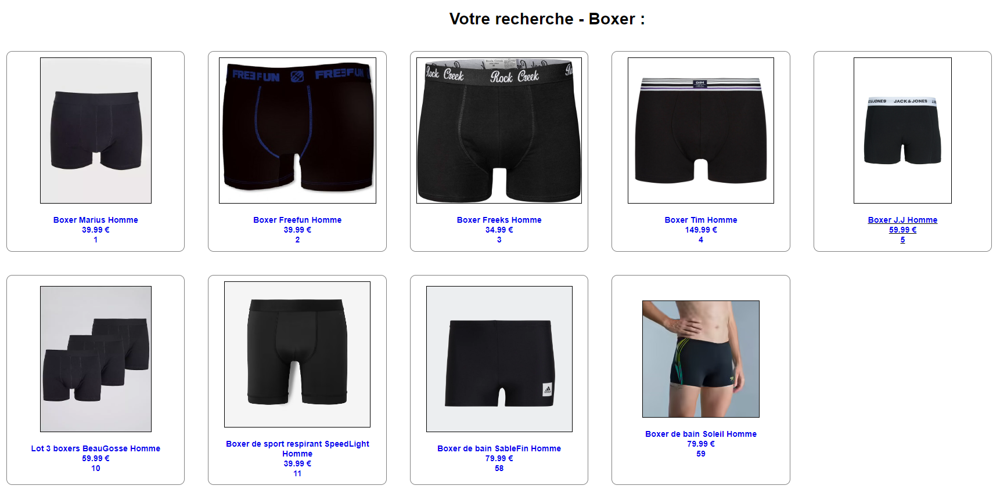

- On peut également rechercher tous les produits d'un genre :

Les produits "Homme" : 

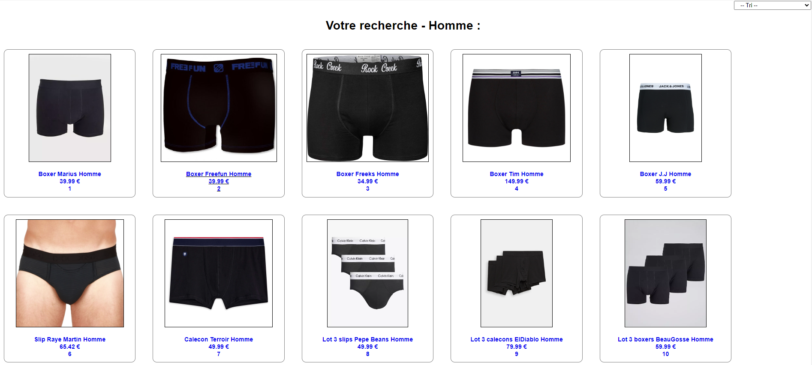

Les produits "Femme" : 

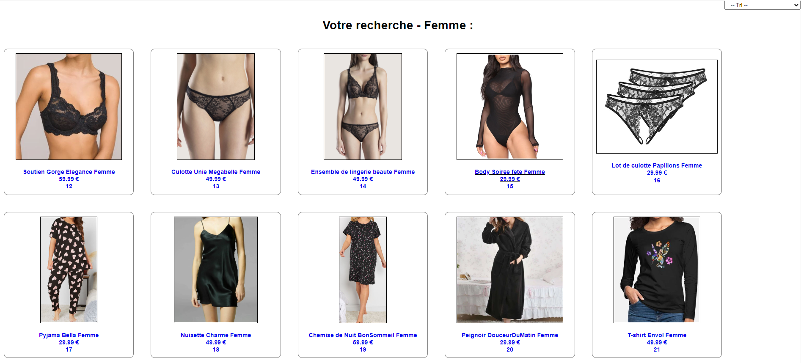

Une fois la recherche effectuée, et si plusieurs produits produits apparaissent, vous pouvez les trier selon différents critères : 

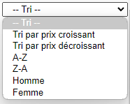

Vous pouvez par exemple rechercher "Lot" et vous tomberez alors sur des produits Homme et Femme. Si vous êtes une femme, vous pourriez ne pas être interessé par les produits Homme et donc ne plus souhaiter les voir afficher. Le résultat serait donc le suivant, seul les produits femme sont affichés :

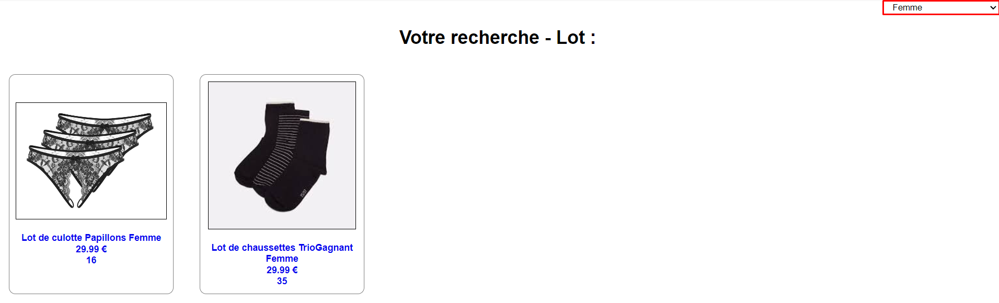

Vous pourriez également trier par prix croissant (_non cumulable avec d'autres critères_) : 

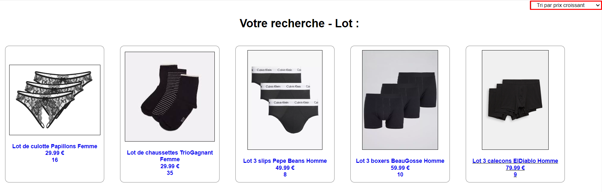

Ou par nom décroissant (_très sensible à la casse des noms des produits_) : 

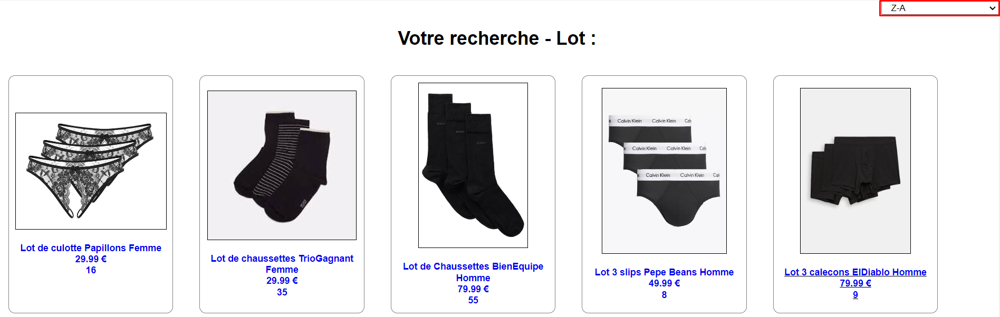

===== Icones Connexion / Déconnexion / Panier

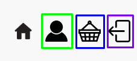

Les derniers éléments de l'entête sont les icones présentes à droite.

On retrouve donc l'icone pour accéder à la page d'accueil comme présenté précédemment dans l'introduction de cette partie.

On peut cliquer sur l'icone "Client" pour accéder à cette page : 

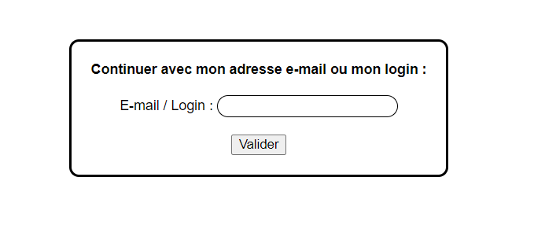

_A noter : la page diffère selon si l'utilisateur est connecté ou simple visiteur_

On peut cliquer sur l'icone "Panier" pour accéder à cette page : 

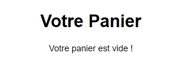

_A noter : la page du panier diffère selon la présence de produits_

*Si vous êtes connecté*, l'icone de déconnexion sera disponible. Si vous cliquez dessus, vous serez déconnecté et l'icone disparaitra.

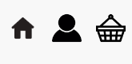

Les pages du panier et de l'utilisateur sont des fonctionnalités à part entière du site, veuillez-vous référer aux sections de la documentation liées pour leur compréhension.

==== Contenu de la page d'accueil

La page d'accueil met trois produits de *_La Parure Française_* en valeur. Ces derniers sont cliquables et renvoie vers une page de détails de produits.(_veuillez-vous référer à la section *Détails Produits* pour plus d'informations_)

Les produits sont affichés avec leurs images respectives (_en couleur_ *_noir_*), le nom du produit, son prix, et son identifiant de produit.

image::images/produits_acc.PNG[piedDePage]

==== Pied de page du site

Le pied de page du site contient divers menus.

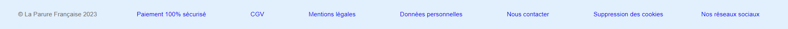

La page "Paiement 100% sécurisé" présente les différents moyens de paiement possibles.

La page "CGV" présente les conditions générales de vente du site triés par thème.

La page "Mentions légales" informe sur des informations techniques, les données personnelles des utilisateurs et sur l'entreprise.

La page "Données personnelles" répond aux questions les plus fréquentes que pourrait se poser tout utilisateur du site.

La page "Nous contacter" est seulement disponible *si vous êtes connecté*. Celle-ci comporte un formulaire de contact si vous avez une question, ou si vous souhaitez contacter les administrateurs du site. Le champ e-mail est pré-rempli avec celui associé au compte actuel.

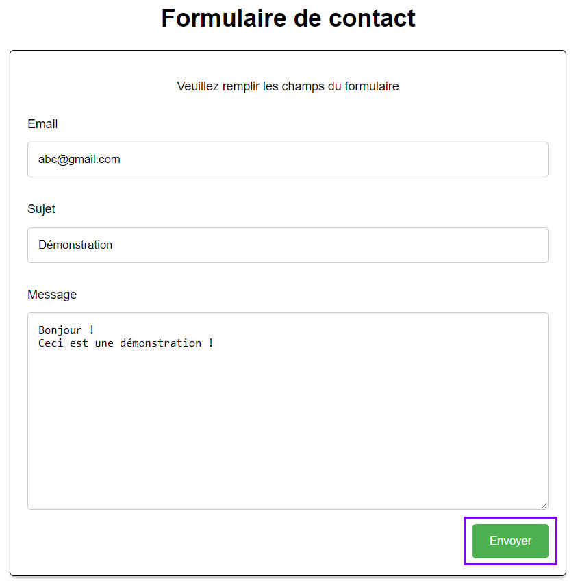

Une fois le formulaire rempli, vous pouvez cliquer sur "Envoyer", et un message de confirmation s'affichera à l'écran en haut du formulaire.

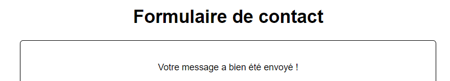

Le bouton "Suppression des cookies" est seulement disponible *si vous êtes connecté* et si vous avez *coché la case "Se souvenir de moi"* lors de la connexion (_veuillez-vous référer à la section *Connexion* pour plus d'informations_). 

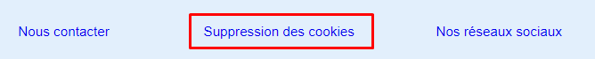

Si vous appuyez sur ce bouton, votre identifiant n'est plus sauvegardé et le bouton s'enlève du menu de bas de page.

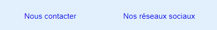

Le bouton "Nos réseaux sociaux" ouvre une page _linktr.ee_ avec tous les réseaux sociaux de *_La Parure Française_*. 

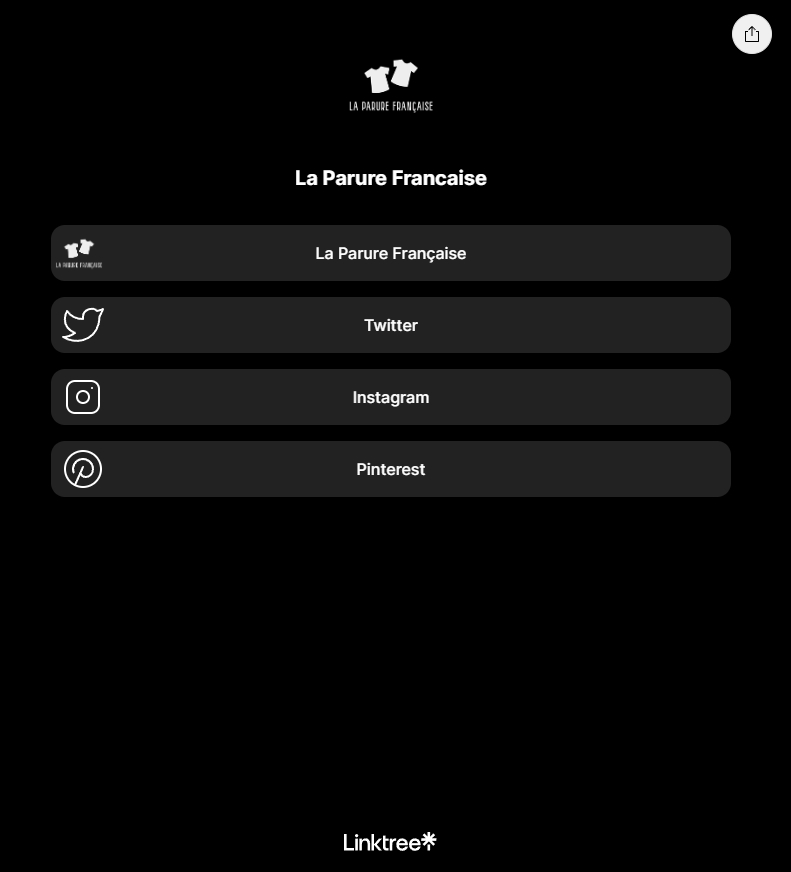

L'ensemble des liens sur ce site sont fonctionnels et sont vérifiés fréquemment. Pour retourner sur la page d'accueil du site, vous pouvez fermer cette page ou cliquer sur "La Parure Française" dans le _linktr.ee_.

=== Les Produits

Imaginons maintenant que vous avez décider d'acheter des boxers, vous vous rendez donc à travers le menu déroulant de l'entête dans "Articles Homme" --> "Sous-vêtements" --> "Boxers". La page suivante apparaît : 

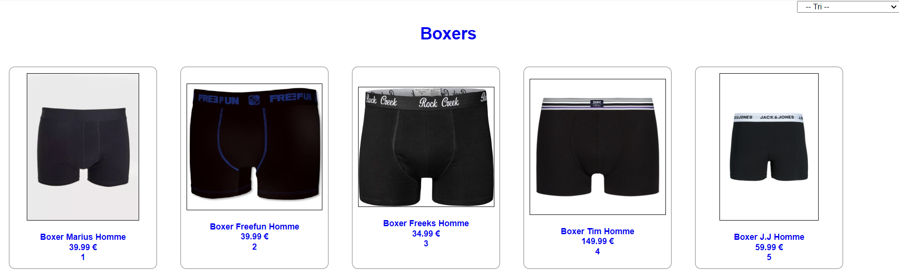

Vous n'avez pas envie de comparer les prix vous-même et décidez donc d'utiliser la fonctionnalité de tri disponible pour pouvoir constater les produits les moins chers en premier.

image::images/triprix.png[panier]

Les trois premiers boxers ont un prix raisonable et vous décidez d'achetez l'un des trois.

=== Les Détails Produits

Vous décidez donc d'aller consulter le "Boxer Marius Homme" car son design vous plait. La page suivante apparait :

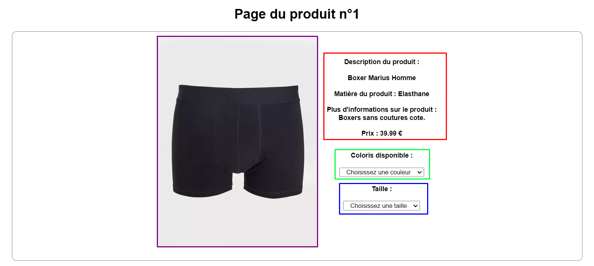

On trouve ici la description complète du produit et son prix ainsi que l'image associé à celui-ci.

Vous décidez ensuite de changer la couleur et vous sélectionnez du blanc. L'aperçu du boxer change donc avec la nouvelle couleur et différente tailles sont maintenant disponibles (_S, M, L, XL, 2XL_). Vous optez pour un boxer de taille L et vous voyez que 4 produits sont en stock. Vous en voulez deux et choisissez *_2_* dans la liste déroulante avec la liste des quantités commandables.

_A noter : S'il n'y a plus de stock sur un produit, le bouton d'ajout au panier n'est plus accessible et il vous sera indiqué "Rupture de stock !"_

L'affichage sur le site est donc le suivant :

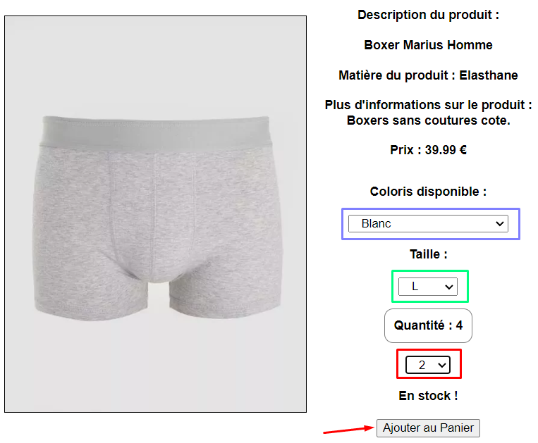

Vous décidez d'ajouter votre produit au panier et cliquez donc sur "Ajouter au Panier".

Le cadre suivant s'affiche désormais au milieu de la page : 

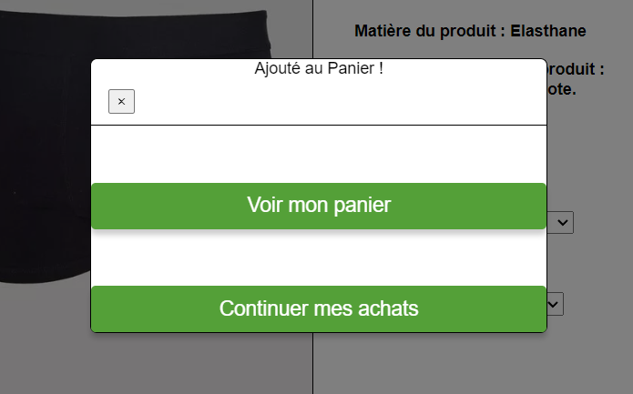

Vous pouvez quitter cet affichage en cliquant sur la croix en haut à gauche, en cliquant sur "Continuer mes achats" ou en cliquant sur la zone grisée à l'extérieur de la zone blanche d'affichage.

C'est ce que l'on fait cette fois-ci car, après avoir bien réfléchis, la version noire du boxer était pas si mal...

On peut constater que l'icone du panier en haut à droite a été mise à jour avec son nombre de produits.

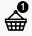

On décide donc maintenant d'ajouter 1 Boxer Marius noir en taille L de plus au panier.

On peut noter encore une fois que l'icone du panier en haut à droite a de nouveau été mise à jour avec son nombre de produits

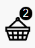

Cette fois-ci, nous avons fini nos emplettes et décidons d'accéder au panier à travers le bouton "Voir mon panier"

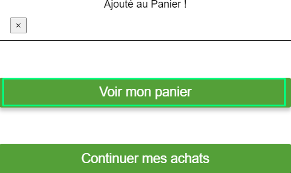

=== Le Panier

Nous arrivons donc sur la page du panier suivante : 

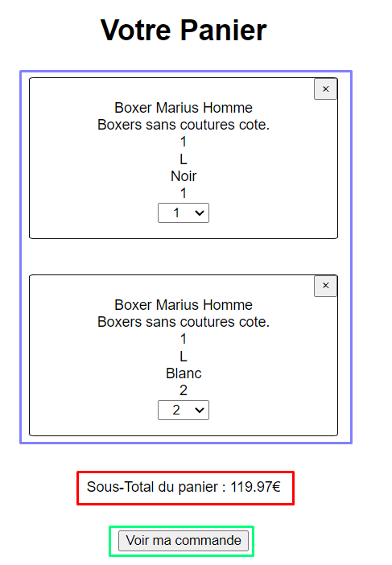

On peut y voir tous les produits que nous y avons ajouté précédemment avec leurs quantités respectives ! On peut également supprimer le/les produits que l'on souhaite et modifier la quantité des produits (*dans les stocks disponibles !*).
Le sous-total du panier s'affiche en bas du panier avec un bouton pour voir le récapitulatif de commande.

Tout à coup, les fonctionnalités disponibles vous donne envie de les tester ! Vous changez donc d'avis et retirez le boxer noir que vous venez d'ajouter au panier.

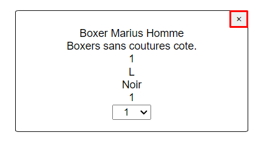

Votre panier ne se compose maintenant plus que d'un article boxer et le sous-total du panier a été mis à jour.

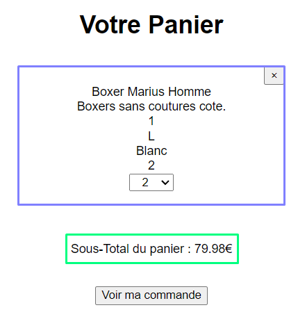

Vous aviez en tête d'acheter trois boxers aujourd'hui et vous décidez donc de d'ajouter un autre boxer marius gris. Vous pouvez directement le faire depuis le panier !

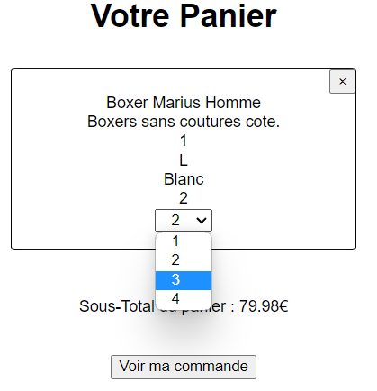

Vous modifiez la quantité et le prix est de nouveau mis à jour.

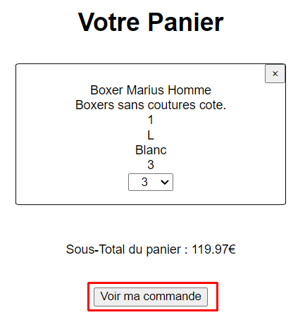

Vous êtes fin prêt à commander ! (_ou presque..._)

=== Compte client

Vous cliquez sur le bouton "Voir ma commande" mais une page apparait ! Vous avez oublié de vous connecter ou de créer un compte client...

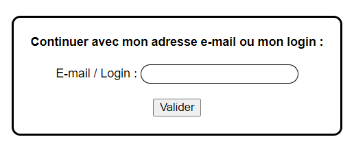

Ne vous inquiétez pas, votre panier sera toujours sauvegardé même si vous vous connectez.

_A noter : si vous possédez déjà un compte client, rendez vous sur la section suivante *Connexion* qui vous expliquera la connexion._

==== Création d'un compte

Si vous n'avez pas de compte, il est nécessaire d'en créer un. Vous rentrez donc votre e-mail / votre login sur la page de connexion.

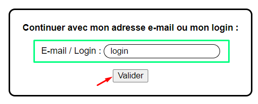

Le système a détecté que vous n'aviez pas de compte, vous êtes donc redirigé vers la page de création de compte avec votre identifiant pré-rempli :

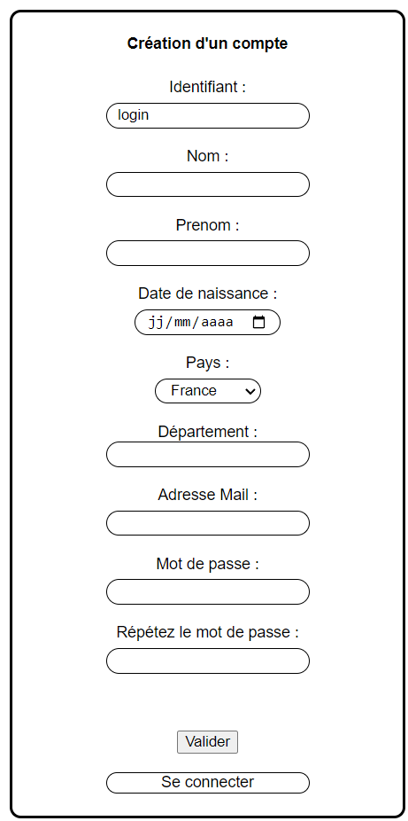

Vous remplissez donc les champs avec vos coordonnées. De nombreuses vérifications en temps réel sont effectués sur l'identifiant, l'email ainsi que le mot de passe pour s'assurer que ceux-ci soient corrects et correspondent à la politique mise en place par le site.

Si vous faites une ou plusieurs erreurs, des messages d'erreurs seront affiché correspondant avec le problème potentiel. Le bouton de validation de création d'un compte sera grisé pendant tant que des erreurs sont affichées.

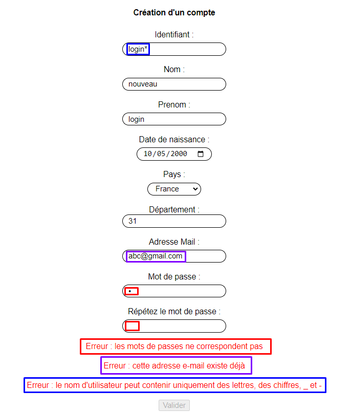

Vous corrigez donc ces erreurs et cliquez sur le bouton "Valider"

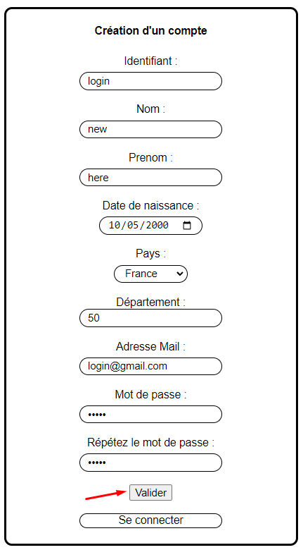

Vous avez maintenant créer un compte avec succès ! Vous êtes redirigé vers la page de connexion précédente.

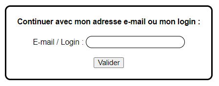

==== Connexion à un compte

Vous pouvez maintenant rentrer l'identifiant de votre compte pour vous connecter et vous cliquez sur Valider.


Le site vous redirige désormais vers la page de connexion et a déjà pré-rempli votre login !

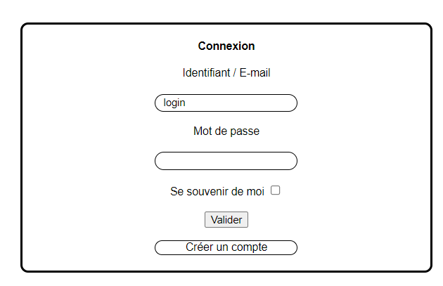

Vous décidez donc de vous connecter et de cocher la case "Se souvenir de moi" qui permet de se souvenir de votre idenfiant pour la prochaine connexion.

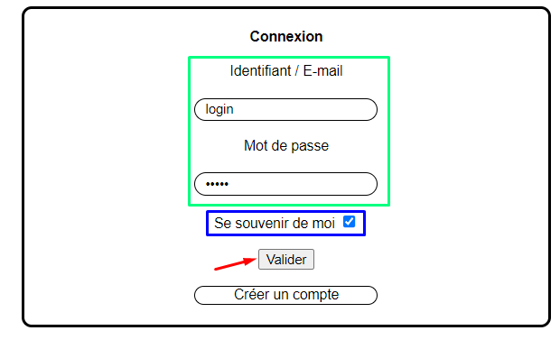

Vous cliquez sur "Valider" et vous voilà connecté et redirigé vers la page d'accueil.

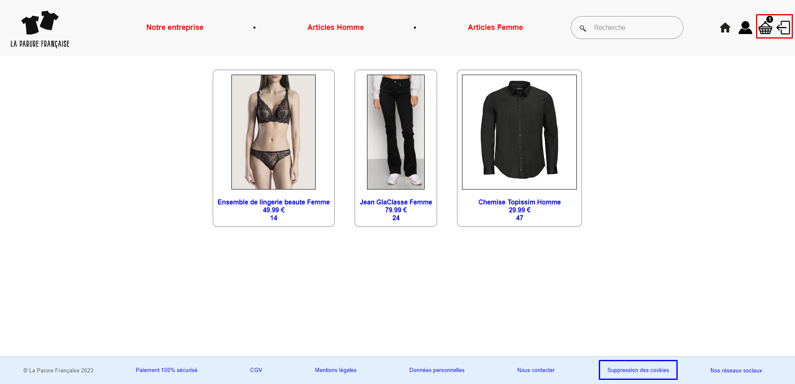

Vous remarquez l'apparition du bouton "Suppression des cookies" dans le bas de page ainsi que l'icone de déconnexion tout à droite de l'entête.

Vous cliquez sur l'icone du panier pour vous assurer que celui-ci est resté identique et vous décider de cliquer de nouveau sur "Voir ma Commande".

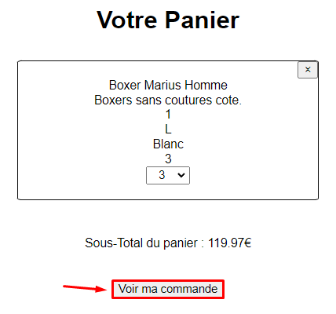

==== Commander

Vous atterrissez donc sur la page suivante qui vous récapitule exclusivement votre commande et vous propose d'ajouter des moyens de paiement et de livraison.

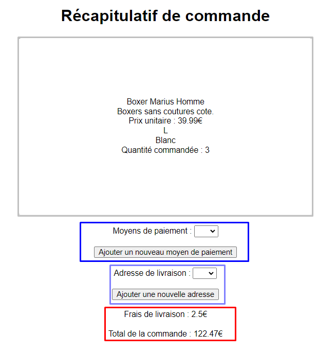

Pour commander, vous ajoutez donc votre carte en cliquant sur le bouton "Ajouter un moyen de paiement". Un petit menu simple et efficace apparait dans lequel vous pourrez rentrer vos coordonnées de carte bancaire en toute sérennité. La longueur des champs ainsi que les formats de chaque champ sont gérés par le site.

*Tous les champs exemples ci-dessous sont fictifs*

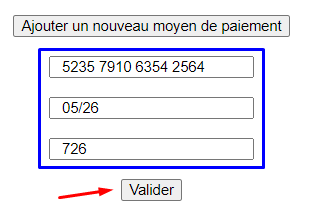

Vous ajoutez donc votre carte en cliquant sur "Valider"

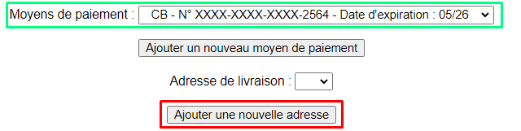

Votre carte apparaît donc maintenant dans le menu déroulant conservant les cartes disponibles qui ne donne seulement que les 4 derniers digits de la carte et sa date d'expiration.

Vous ajoutez donc également votre adresse pour la livraison

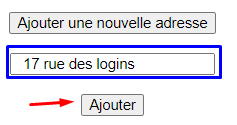

Une fois le moyen de paiement et l'adresse de livraison ajoutés, le bouton de confirmation de commande apparait !

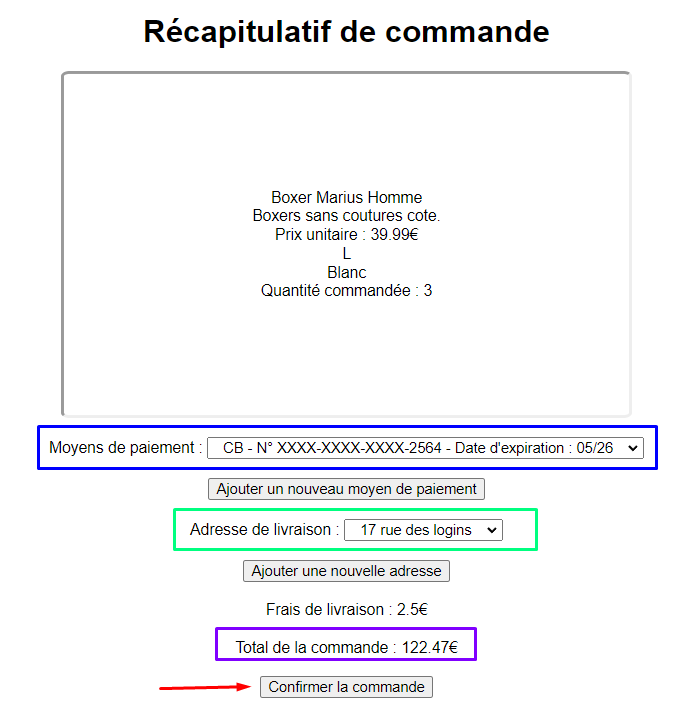

On peut donc bien voir le moyen de paiement que l'on a ajouté, l'adresse de livraison choisie et le total de la commande (_composé du sous-total panier + des frais de livraison_). On peut maintenant commander !

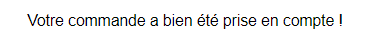

Un message de validation de commande s'affiche donc si la commande a bien été prise en compte.

Vous voulez vous assurer que la commande a bien été prise en compte, vous retournez donc voir le stock du produit que vous avez commandé (_boxer marius blanc L_) et vous voyez que la quantité en stock a bien diminué !

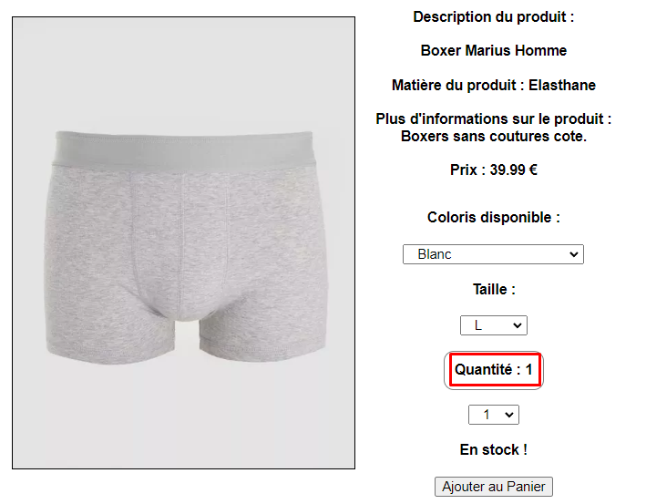

==== Consulter un compte client

Maintenant que vous avez commander, vous souhaitez aller consulter votre compte.

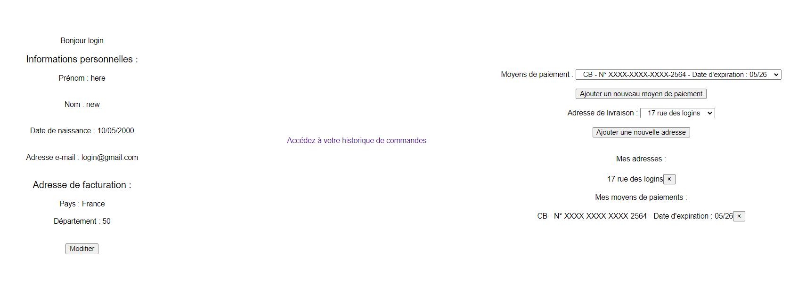

Lors de la lecture de vos informations personnelles vous vous rendez compte que vous avez fait une erreur sur votre date de naissance !

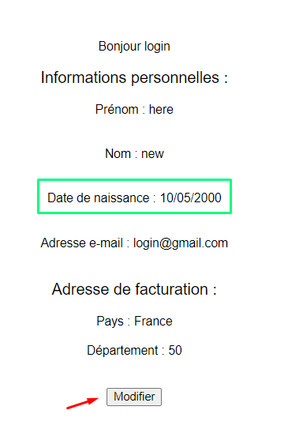

Vous cliquez donc sur "Modifier" et vous rectifiez l'erreur que vous avez effectuer.

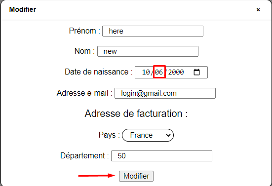

Vous cliquez sur "Modifier" de nouveau et la page vous affiche maintenant la bonne date de naissance.

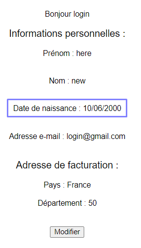

Vous continuez à parcourir les pages et vous vous rendez compte que vous pouvez également supprimer des adresses et en ajouter depuis ce menu.

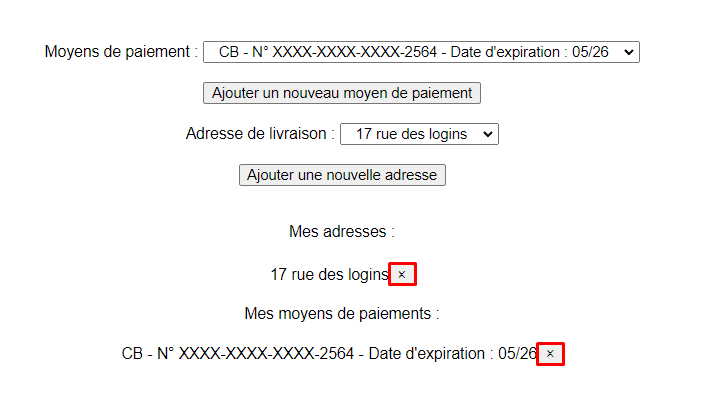

Vous retirez donc vos précédentes saisies grâce aux boutons présents

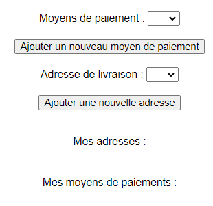

Pour finir, vous décider d'aller consulter votre historique de commande.

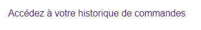

Vous constatez que la commande que vous veniez d'effectuer a bien été enregistrée !

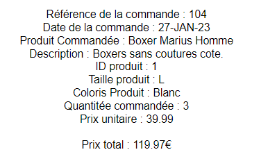

== Fonctionnalités administration

Si vous êtes un administrateur du site, ce bouton devrait apparaitre :

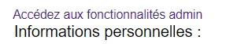

4 choix possibles sous forme de boutons devrait s'offrir à vous : 

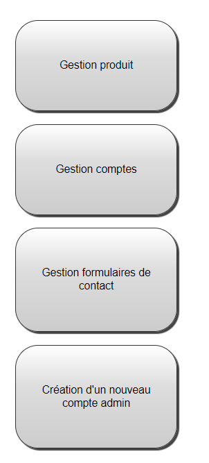

=== Gestion des produits

Il est possible de gérer le stock de l'ensemble des produits. Les produits en rupture de stock sont placés en début de page afin de d'assurer que ceux-ci soient prioritaires.

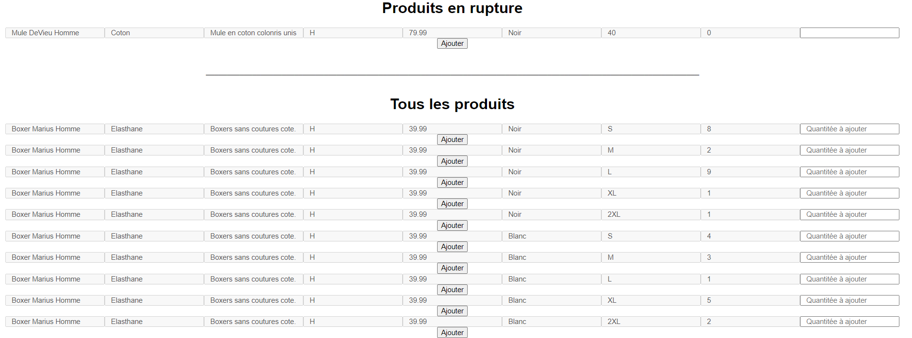

On peut ajouter du stock à un produit (_par exemple ici 5_)

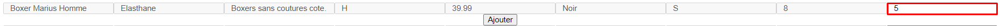

Et son stock général sera modifié avec l'ancien stock + la nouvelle valeur ajoutée.

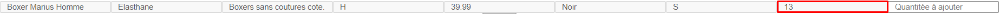

On peut également ajouté du stock sur l'un des produits en rupture.

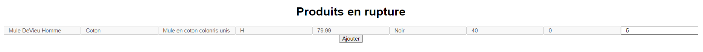

Si plus aucun des produits n'est en rupture de stock, un message est affiché pour l'indiqué.

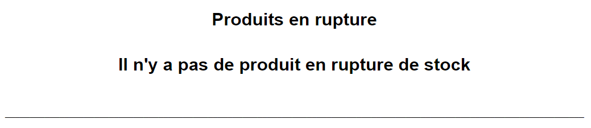

On peut voir que le produit précédemment hors de stock possède maintenant 5 de stock conformément à ce que l'on a rentré dans le champ d'ajout.

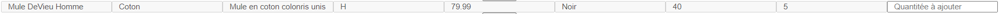

=== Gestion des comptes

Vous pouvez également en tant qu'administrateur gérer les comptes clients et les comptes administrateurs. La liste des comptes avec leurs informations est affichée dans ce menu.

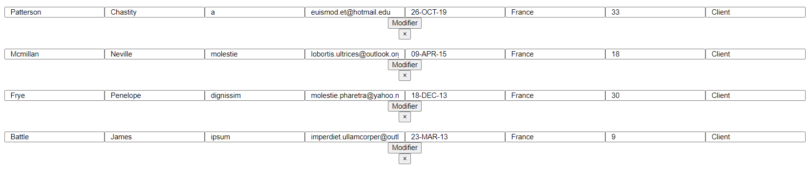

Si l'on souhaite modifier les informations d'un compte en particulier, il est nécessaire de cliquer sur le bouton Modifier sous les informations du client choisi.

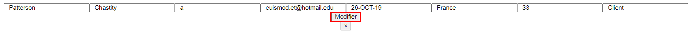

On peut donc ensuite modifier les informations, tel qu'ici l'adresse mail et l'adresse de facturation du client.

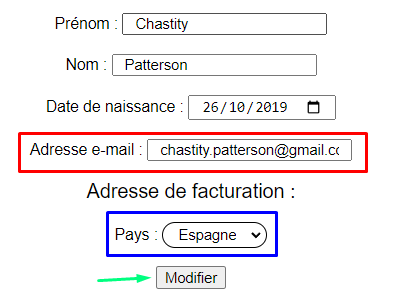

Après avoir validé les modifications, on peut voir les changements apparaitre avec la modification immédiate et effective de l'adresse mail ainsi que le changement de pays avec la suppression du département.

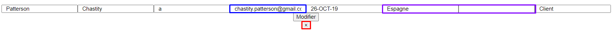

On souhaiterait maintenant supprimer le compte client que l'on vient de modifier car celui-ci est obsolète. Il nous suffit de cliquer sur le bouton en forme de croix et celui-ci disparait de la liste des comptes de l'entreprise.

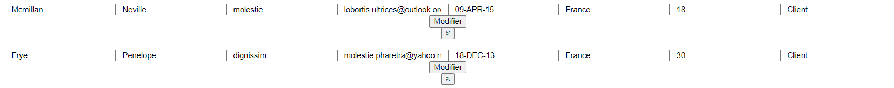

=== Gestion des formulaires de contact

Vous pouvez consulter les messages des clients dans le menu de gestion des formulaires de contact et revenir à l'accueil quand vous le souhaitez.

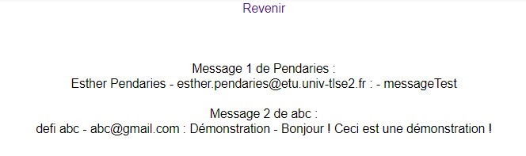

=== Création d'un nouveau compte administrateur

La création d'un compte administrateur est très similaire à la création d'un compte client. Seul le rôle de l'utilisateur créé change à la création.

_A noter : vous pouvez vous référer à la section de création d'un compte client si vous souhaitez plus d'informations_

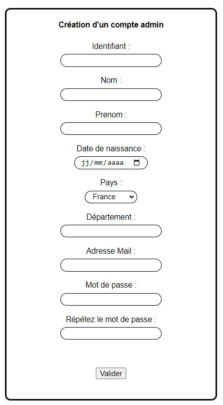

Vous remplissez les informations du compte et vous cliquez sur valider. Si aucun message d'erreur n'apparait, le compte a bien été créé.

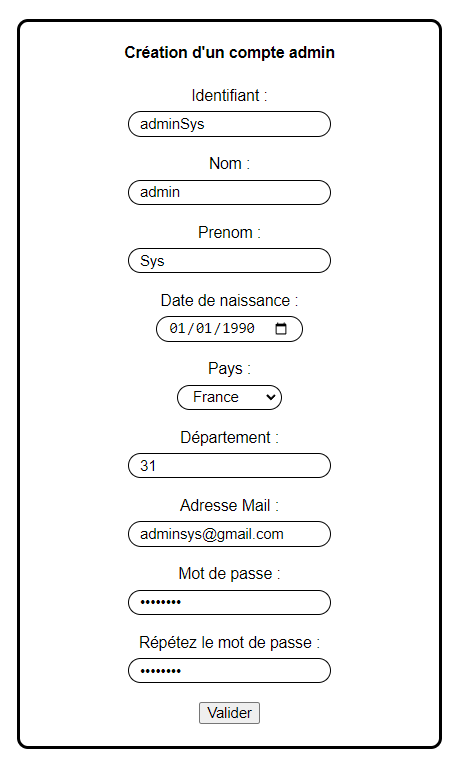

Vous êtes maintenant redirigé vers la page du menu administrateur.


