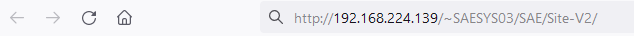
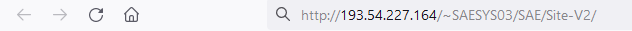
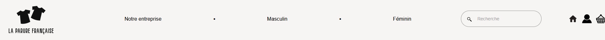
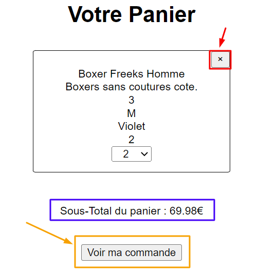

= Documentation Utilisateur site web G1A-3
:toc:
:toc-title: Table des matières
:sectnums:
:sectnumlevels: 4
:hide-uri-scheme:   

== Introduction
Bienvenue sur notre site web de vente de vêtements en ligne ! Nous sommes heureux de vous offrir une expérience d'achat en ligne simple et agréable. Avec une variété de styles, de tailles et de prix, il y a quelque chose pour tout le monde.

Nous avons créé un système de navigation convivial et intuitif pour vous permettre de trouver facilement les articles que vous recherchez. Sur notre site, vous pourrez :

    - Parcourir les différentes catégories de vêtements (homme, femme)
    - Utiliser notre barre de recherche pour trouver des articles spécifiques
    - Ajouter des articles à votre panier et effectuer des achats en toute sécurité
    - Consulter votre historique de commandes
    - Créer un compte pour enregistrer vos informations et faciliter vos prochains achats

Nous espérons que vous apprécierez votre expérience d'achat sur notre site web.

== Accéder au site web

=== Avec le réseau de l'IUT (filaire)
Afin d'accéder à notre site ouvrez votre navigateur web et saisissez l'adresse suivante : http://192.168.224.139/~SAESYS03/Site

=== Avec votre propre réseau

Afin d'accéder à notre site ouvrez votre navigateur web et saisissez l'adresse suivante : http://193.54.227.164/~SAESYS03/Site

== Accueil

=== En-tête du site 

Lorsque vous êtes redirigé vers notre site vous arrivez sur la page d'accueil. Vous pouvez y accéder à tout moment en cliquant sur le logo de notre site en haut à gauche de la page.

=== Pied de page du site

Le pied de page du site contient des informations sur notre société, ainsi que des liens vers nos réseaux sociaux. (Servant notamment à nous contacter)

== Recherche de produit 

Pour rechercher un produit, il vous suffit de cliquer sur la barre de recherche au milieu de la page et de saisir le nom du produit que vous souhaitez trouver.

image::images/rechercheProduit.PNG[rechercheProduit]

== Consultation du panier

Pour consulter votre panier, il vous suffit de cliquer sur le logo du "Panier" en haut à droite de la page. La page suivante s'affiche donc :

== Création de compte

On peut créer un compte :

* Si on tente de cliquer immédiatement sur le bouton _Valider_ : 

image::./imagesTest/PbCreation.png[CreationVide]

* Si l'utilisateur remplis tous les champs nécessaires pour la création du compte : 

image::./imagesTest/CreationCompteClient.png[CreationCorrecteCompte]

* L'utilisateur est redirigé vers l'index :

image::./imagesTest/RedirectionVersIndexApresCreation.png[RedirectionIndexApresCreation (non connecté)]

* On peut aller vérifier que le client a bien été créé dans la base de données et que le mot de passe entré par l'utilisateur a bien été hashé :

image::./imagesTest/CreationDuClientBD.png[AjoutBDNouveauClient + Password Hash]

* Après la création du compte, on peut tenter de se connecter à celui-ci avec les identifiants que l'utilisateur vient de créer :

image::./imagesTest/connexionNouveauClient.png[ConnexionCompteNouveau]

Même si le mot de passe est stockée chiffrée, on utilise une fonction PHP permettant de s'assurer que celui entrée par l'utilisateur dans le formulaire correspond à celui dans la base de données.

* La connexion fonctionne et l'utilisateur voit un message de connexion s'afficher :

image::./imagesTest/AffMessageNouveauClient.png[ConnexionNouveau]

